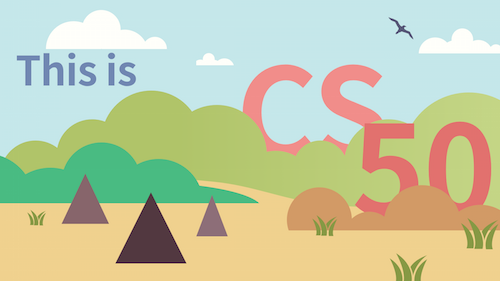

This is the code of my CS50 Final Project -- xRate.
;

List of country    ISO 3166-1 alpha-2
https://en.wikipedia.org/wiki/ISO_3166-1_alpha-2#Officially_assigned_code_elements

List of circulating currencies  
https://en.wikipedia.org/wiki/List_of_circulating_currencies

